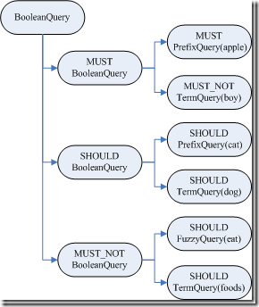

# Lucene 查询
### 示例01
```java
public class Stu_Search_Demo01 {
    public static void main(String[] args) throws IOException, ParseException {
        Path indexPath = FileSystems.getDefault().getPath("/home/wei/OPEN_SOURCE/Lucene/Berries-log/Index-Stu-001");
        Directory dir = FSDirectory.open(indexPath);
        
        QueryParser parser = new QueryParser("Content", new StandardAnalyzer());
        Query query = parser.parse("+(+apple* -sean) (cat* dog) -(eat~ foods)");
        
        // 1. IndexReader打开索引文件，读取并打开指向索引文件的流。
        IndexReader reader = DirectoryReader.open(dir);
        // 2. 打开IndexSearcher
        IndexSearcher searcher = new IndexSearcher(reader);

        TopDocs topDocs = searcher.search(query, 50);

        if (topDocs.totalHits.value() > 0) {
            for (ScoreDoc scoreDoc : topDocs.scoreDocs) {
                int docNum = scoreDoc.doc;
                Document doc = searcher.getIndexReader().storedFields().document(docNum);
                System.out.println(doc.toString());
            }
        }
    }
}
```

通过调试，可以获得语法树如下:



+ BooleanQuery即**所有的子语句按照布尔关系合并**
  - +也即MUST表示必须满足的语句
  - SHOULD表示可以满足的，minNrShouldMatch表示在SHOULD中必须满足的最小语句个数，默认是0，也即既然是SHOULD，也即或的关系，可以一个也不满足(当然没有MUST的时候除外)。
  -  -也即MUST_NOT表示必须不能满足的语句
+ 树的叶子节点中：
  - 最基本的是TermQuery，也即表示一个词
  - 当然也可以是PrefixQuery和FuzzyQuery，这些查询语句由于特殊的语法，可能对应的不是一个词，而是多个词，因而他们都有rewriteMethod对象指向MultiTermQuery的Inner Class，表示对应多个词，在查询过程中会得到特殊处理。