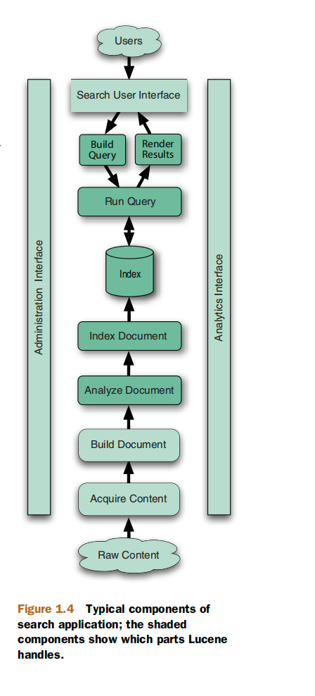
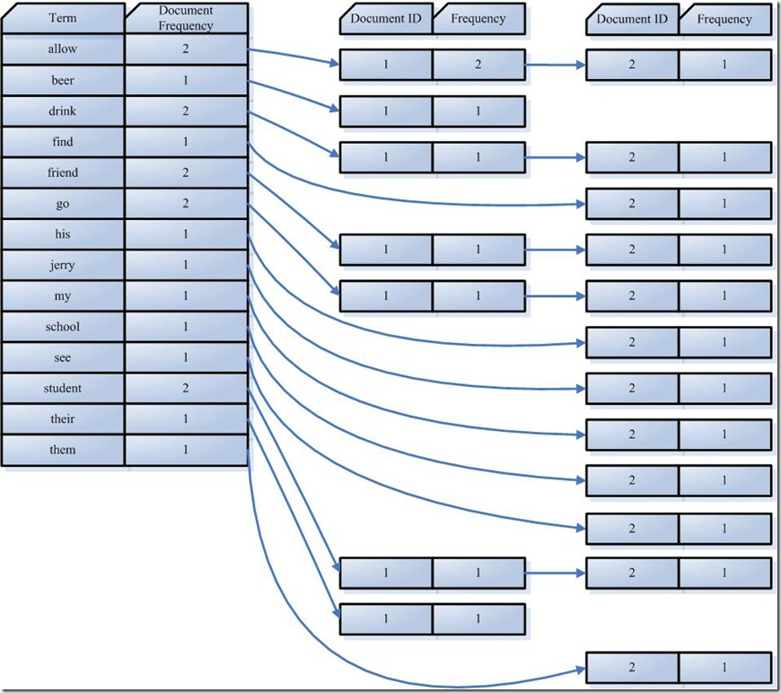
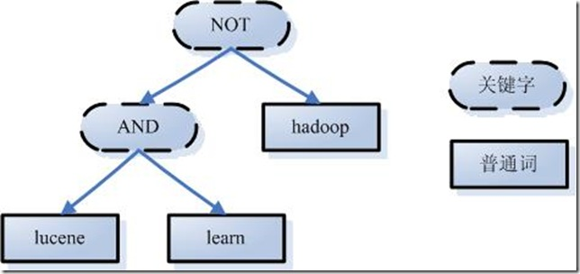

# Lucene
Lucene是一个高效的，基于Java的全文检索库。

Apache Lucene™ is a high-performance, full-featured search engine library written entirely in Java. It is a technology suitable for nearly any application that requires structured search, full-text search, faceting, nearest-neighbor search across high-dimensionality vectors, spell correction or query suggestions.
> Apache Lucene™ 是一个高性能、功能齐全的搜索引擎库，完全用 Java 编写。该技术适用于几乎所有需要结构化搜索、全文搜索、分面、跨高维向量的最近邻搜索、拼写纠正或查询建议的应用程序。

## 什么是全文搜索
生活中的数据分为两部分: **结构化数据**  和  **非结构化数据**
- 结构化数据： 指具有固定格式或有限长度的数据，如数据库，元数据等
- 非结构化数据（*全文数据*）: 指不定长或无固定格式的数据，如 邮件 word文档等
- 半结构化数据： XML ， HTML ，当根据需要可按结构化数据来处理，也可提取出纯文本按非结构化数据来处理。

按照数据的分类，搜索也分为两种:
1. 对结构化数据的搜索: 如对数据库的搜索，用SQL语句。再对元数据的搜索，如利用Windows搜索对文件名、类型、修改时间进行搜索等
2. 对非结构化数据的搜索： 如利用Windows的搜索也可搜索文件内容，Linux下的grep命令，用Google和百度可以搜索大量内容数据

对非结构化数据（全文数据）搜索主要有两种方式:
1. 顺序扫描法: 例如要找内容包含某一个字符串的文件，就是一个文档一个文档地看，对于每一个文件，从头看到尾，如果此文档包含此字符串，则此文档为我们要找的文档，接着看下一个文档，直到扫描完所有的文档。
2. 全文检索
    1. 导引: 对非结构化数据顺序扫描很慢，对结构化数据的搜索却相对较快(由于结构化数据有一定的结构可以采取一定的搜索算法加快速度)，那么将非结构化数据想办法弄得有一定结构不就行了?
    2. Next: 这种想法构成了全文检索的基本思路，也即将对非结构化数据中的一部分信息提取出来，重新组织，使其变得有一定结构，然后对此有一定结构的数据进行搜索，从而达到搜索较快的目的。
    3. 从非结构化数据中提取出的然后重新组织的信息 ，称之为 索引
    4. **这种先建立索引，再对索引进行搜索的过程就叫全文检索（Full-Text Search）**
    
    > 图 1.4 搜索应用程序的典型组件；阴影部分表示 Lucene 处理的部分。

### 全文搜索
全文搜索分为两个过程: 索引创建(Indexing) 和 搜索索引(Search)
- 索引创建: 将现实世界中所有的结构化和非结构化数据提取信息，创建索引的过程
- 搜索索引： 得到用户的查询请求，搜索创建的索引，然后返回结果的过程

全文索引三个重要的问题:
1. 索引里面究竟存了些什么?
2. 如何创建索引?
3. 索引如何搜索

#### 1. 全文索引存的是什么
由于从字符串(词典)到文件(文档)的映射是文件到字符串映射的反向过程，于是保存这种信息的索引称为反向索引
- 即 词典到文档 的映射关系

#### 2. 如何创建索引
1. 原材料准备: 需要被索引的文档
2. 分词： 将原文档传给分词组件(Tokenizer) ， 得到词元(Token)
   1. 将文档分成一个一个单独的单词
   2. 去除标点符号。
   3. 去除停词(Stop word)。
      - 所谓停词(Stop word)就是一种语言中最普通的一些单词，由于没有特别的意义，因而大多数情况下不能成为搜
索的关键词，因而创建索引时，这种词会被去掉而减少索引的大小，如 a the this 等
      - 对于每一种语言的分词组件(Tokenizer)，都有一个停词(stop word)集合
   4. 经过分词(Tokenizer)后得到的结果称为词元(Token)。
3. 将得到的词元(Token)传给语言处理组件(Linguistic Processor)，得到词(Term)
   - 语言处理组件(linguistic processor)主要是对得到的词元(Token)做一些同语言相关的处理，对于英语，语言处理组件(Linguistic Processor)一般做以下几点
      + 变为小写(Lowercase)。
      + 将单词缩减为词根形式，如“cars”到“car”等。这种操作称为：stemming。
      + 将单词转变为词根形式，如“drove”到“drive”等。这种操作称为：lemmatization。
      + Stemming 和 lemmatization的异同：
        - 相同之处：Stemming和lemmatization都要使词汇成为词根形式
        - 不同: Stemming采用的是“缩减”的方式：“cars”到“car”
        - 不同: Lemmatization采用的是“转变”的方式：“drove”到“drove”
        - 两者的算法不同:
          + Stemming主要是采取某种固定的算法来做这种缩减，如去除“s”，去除“ing”加“e”，将
“ational”变为“ate”，将“tional”变为“tion”
          + Lemmatization主要是采用保存某种字典的方式做这种转变。比如字典中有“driving”到
“drive”，“drove”到“drive”，“am, is, are”到“be”的映射，做转变时，只要查字典
就可以了

4. 将得到的词(Term)传给索引组件(Indexer)
索引组件(Indexer)主要做以下几件事情：
   1. 利用得到的词(Term)创建一个字典。
   2. 对字典按字母顺序进行排序。
   3. 合并相同的词(Term)成为文档倒排(Posting List)链表。
      
      - Document Frequency 即文档频次，表示总共有多少文件包含此词(Term)。
      - Frequency 即词频率，表示此文件中包含了几个此词(Term)。
        - 对词(Term) “allow”来讲，总共有两篇文档包含此词(Term)，从而词(Term)后面的文档链表总共有两
项，第一项表示包含“allow”的第一篇文档，即1号文档，此文档中，“allow”出现了2次，第二项表示包含
“allow”的第二个文档，是2号文档，此文档中，“allow”出现了1次。

#### 索引如何搜索
1. 用户输入查询语句。
   - lucene AND learned NOT hadoop。
2. 对查询语句进行词法分析，语法分析，及语言处理。
   1. 词法分析主要用来识别单词和关键字。
      + 经过词法分析，得到单词有lucene，learned，hadoop, 关键字有AND, NOT。如果在词法分析中发现不合法的关键字，则会出现错误。如lucene AMD learned，其中由于AND拼错，导致AMD作为一个普通的单词参与查询。
   2. 语法分析主要是根据查询语句的语法规则来形成一棵语法树。
       
   3. 语言处理同索引过程中的语言处理几乎相同。
      - 如learned变成learn等。
        
3. 搜索索引，得到符合语法树的文档。
   1. 首先，在反向索引表中，分别找出包含lucene，learn，hadoop的文档链表。
   2. 其次，对包含lucene，learn的链表进行合并操作，得到既包含lucene又包含learn的文档链表。
   3. 然后，将此链表与hadoop的文档链表进行差操作，去除包含hadoop的文档，从而得到既包含lucene又包含learn而且不包含hadoop的文档链表。
   4. 此文档链表就是我们要找的文档。
4. 根据得到的文档和查询语句的相关性，对结果进行排序 ——— 分数
   - 对于查询结果应该按照与查询语句的相关性进行排序，越相关者越靠前
   - 找出词(Term)对文档的重要性的过程称为计算词的权重(Term weight)的过程。
   - 判断词(Term)之间的关系从而得到文档相关性的过程应用一种叫做向量空间模型的算法(Vector Space
Model)。
      + 计算权重(Term weight)的过程: 影响一个词(Term)在一篇文档中的重要性主要有两个因素：
         - Term Frequency (tf)：即此Term在此文档中出现了多少次。tf 越大说明越重要。
         - Document Frequency (df)：即有多少文档包含次Term。df 越大说明越不重要。
         - 词(Term)在文档中出现的次数越多，说明此词(Term)对该文档越重要，如“搜索”这个词，在本文档中出现的次数很多，说明本文档主要就是讲这方面的事的。然而在一篇英语文档中，this出现的次数更多，就说明越重要吗？不是的，这是由第二个因素进行调整，第二个因素说明，有越多的文档包含此词(Term), 说明此词(Term)太普通，不足以区分这些文档，因而重要性越低。
      + 判断Term之间的关系从而得到文档相关性的过程，也即向量空间模型的算法(VSM)。—— 公式计算 (即 打分)

---

## 参考资料
1. [https://lucene.apache.org/core/index.html](https://lucene.apache.org/core/index.html)