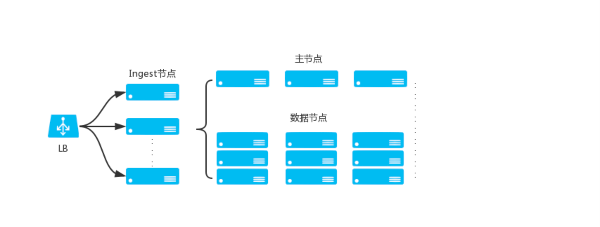

# Nodes
Any time that you start an instance of Elasticsearch, you are starting a node. A collection of connected nodes is called a cluster. If you are running a single node of Elasticsearch, then you have a cluster of one node.(每次启动ElasticSearch实例时，您都会启动一个节点。已连接节点的集合称为集群。如果你运行的是单个Elasticsearch节点，那么你就拥有一个由一个节点组成的集群)

Every node in the cluster can handle HTTP and transport traffic by default. The transport layer is used exclusively for communication between nodes; the HTTP layer is used by REST clients.(集群中的每个节点默认都可以处理 HTTP 和传输流量。传输层专门用于节点之间的通信；HTTP 层由 REST 客户端使用。)

All nodes know about all the other nodes in the cluster and can forward client requests to the appropriate node.(所有节点都知道集群中的所有其他节点，并可以将客户端请求转发到适当的节点。)

## Node roles
You define a node’s roles by setting node.roles in elasticsearch.yml. If you set node.roles, the node is only assigned the roles you specify. If you don’t set node.roles, the node is assigned the following roles:(通过在 elasticsearch.yml 中设置 node.roles 来定义节点的角色。如果设置了 node.roles，则节点只会被分配您指定的角色。如果未设置 node.roles，则节点会被分配以下角色：)
```txt
   master
   data
   data_content
   data_hot
   data_warm
   data_cold
   data_frozen
   ingest
   ml
   remote_cluster_client
   transform
```
If you set node.roles, ensure you specify every node role your cluster needs. Every cluster requires the following node roles:(如果设置了 node.roles，请确保指定集群所需的每个节点角色。每个集群都需要以下节点角色：)
- master
- data_content and data_hot 或者  data 

As the cluster grows and in particular if you have large machine learning jobs or continuous transforms, consider separating dedicated master-eligible nodes from dedicated data nodes, machine learning nodes, and transform nodes.（随着集群的增长，特别是如果您有大型机器学习作业或连续转换，请考虑将专用的主合格节点与专用数据节点、机器学习节点和转换节点分开。）

### 角色1：Master-eligible node <sup>候选主节点</sup>
> eligible: 符合条件

&nbsp;&nbsp;The master node is responsible for lightweight cluster-wide actions such as creating or deleting an index, tracking which nodes are part of the cluster, and deciding which shards to allocate to which nodes. It is important for cluster health to have a stable master node.(主节点负责轻量级集群范围的操作，例如创建或删除索引、跟踪哪些节点属于集群以及决定将哪些分片分配给哪些节点。拥有稳定的主节点对于集群健康至关重要。)

&nbsp;&nbsp;Any master-eligible node that is not a voting-only node may be elected to become the master node by the master election process.(任何符合主节点条件的节点（不是仅投票节点）都可以通过主节点选举流程当选为主节点。)

&nbsp;&nbsp;Master nodes must have a path.data directory whose contents persist across restarts, just like data nodes, because this is where the cluster metadata is stored. The cluster metadata describes how to read the data stored on the data nodes, so if it is lost then the data stored on the data nodes cannot be read.（主节点必须有一个 path.data 目录，其内容在重启后保持不变，就像数据节点一样，因为这是存储集群元数据的地方。集群元数据描述了如何读取存储在数据节点上的数据，因此如果丢失了集群元数据，则无法读取存储在数据节点上的数据。）
> 主节点元数据存储在 path.data  目录中

#### 角色1.1: Dedicated master-eligible node <sup>专用候选主节点</sup>
> 当集群足够大的时候，需要配置专用主节点(执行集群管理操作，不执行其他操作)

&nbsp;&nbsp;It is important for the health of the cluster that the elected master node has the resources it needs to fulfill its responsibilities. If the elected master node is overloaded with other tasks then the cluster will not operate well. The most reliable way to avoid overloading the master with other tasks is to configure all the master-eligible nodes to be dedicated master-eligible nodes which only have the master role, allowing them to focus on managing the cluster. Master-eligible nodes will still also behave as coordinating nodes that route requests from clients to the other nodes in the cluster, but you should not use dedicated master nodes for this purpose.(对于集群的健康而言，当选的主节点是否拥有履行其职责所需的资源非常重要。如果当选的主节点因其他任务而超负荷，则集群将无法正常运行。避免主节点因其他任务而超负荷的最可靠方法是将所有符合主节点条件的节点配置为专用的符合主节点条件的节点，这些节点仅具有主节点角色，从而使它们专注于管理集群。符合主节点条件的节点仍将充当协调节点，将客户端的请求路由到集群中的其他节点，但您不应为此目的使用专用的主节点。)

&nbsp;&nbsp;A small or lightly-loaded cluster may operate well if its master-eligible nodes have other roles and responsibilities, but once your cluster comprises more than a handful of nodes it usually makes sense to use dedicated master-eligible nodes.(如果符合主节点条件的节点具有其他角色和职责，小型或轻负载集群可能会运行良好，但是一旦您的集群包含多个节点，通常最好使用专用的符合主节点条件的节点。)

&nbsp;&nbsp;To create a dedicated master-eligible node, set:
  ```yaml
     node.roles: [ master ]
  ```

--- 

#### 角色1.2：Voting-only master-eligible node
&nbsp;&nbsp;A voting-only master-eligible node is a node that participates in master elections but which will not act as the cluster’s elected master node. In particular, a voting-only node can serve as a tiebreaker in elections.（仅投票的符合主节点资格的节点是参与主节点选举但不会充当集群的当选主节点的节点。特别是，仅投票节点可以充当选举中的决胜局。）

&nbsp;&nbsp;It may seem confusing to use the term "master-eligible" to describe a voting-only node since such a node is not actually eligible to become the master at all. This terminology is an unfortunate consequence of history: master-eligible nodes are those nodes that participate in elections and perform certain tasks during cluster state publications, and voting-only nodes have the same responsibilities even if they can never become the elected master.（使用术语“符合主节点资格”来描述仅投票节点似乎令人困惑，因为这样的节点实际上根本没有资格成为主节点。这个术语是历史的不幸后果：符合主节点资格的节点是那些参与选举并在集群状态发布期间执行某些任务的节点，而仅投票节点即使永远无法成为当选主节点也具有相同的责任。）

&nbsp;&nbsp;To configure a master-eligible node as a voting-only node, include master and voting_only in the list of roles. For example to create a voting-only data node:（要将符合主节点资格的节点配置为仅投票节点，请在角色列表中包含 master 和 voting_only。例如，要创建仅投票数据节点：）
```yaml
   node.roles: [ data, master, voting_only ]
```

&nbsp;&nbsp;Only nodes with the master role can be marked as having the voting_only role.（只有具有 master 角色的节点才能被标记为具有 voting_only 角色。）

&nbsp;&nbsp;High availability (HA) clusters require at least three master-eligible nodes, at least two of which are not voting-only nodes. Such a cluster will be able to elect a master node even if one of the nodes fails.（高可用性 (HA) 集群需要至少三个主节点，其中至少两个不是仅投票节点。即使其中一个节点发生故障，这样的集群也能够选举主节点。）

&nbsp;&nbsp;Voting-only master-eligible nodes may also fill other roles in your cluster. For instance, a node may be both a data node and a voting-only master-eligible node. A dedicated voting-only master-eligible nodes is a voting-only master-eligible node that fills no other roles in the cluster. To create a dedicated voting-only master-eligible node, set:（仅投票主节点也可能充当集群中的其他角色。例如，一个节点可能既是数据节点，又是仅投票主节点。专用仅投票主节点是仅投票主节点，不充当集群中的其他角色。要创建专用仅投票主节点，请设置：）
```yaml
   node.roles: [ master, voting_only ]
```

&nbsp;&nbsp;Since dedicated voting-only nodes never act as the cluster’s elected master, they may require less heap and a less powerful CPU than the true master nodes. However all master-eligible nodes, including voting-only nodes, are on the critical path for publishing cluster state updates. Cluster state updates are usually independent of performance-critical workloads such as indexing or searches, but they are involved in management activities such as index creation and rollover, mapping updates, and recovery after a failure. The performance characteristics of these activities are a function of the speed of the storage on each master-eligible node, as well as the reliability and latency of the network interconnections between the elected master node and the other nodes in the cluster. You must therefore ensure that the storage and networking available to the nodes in your cluster are good enough to meet your performance goals.(由于专用的仅投票节点从不充当集群的当选主节点，因此它们可能需要比真正的主节点更少的堆和更弱的 CPU。但是，所有主节点合格节点（包括仅投票节点）都位于发布集群状态更新的关键路径上。集群状态更新通常与性能关键型工作负载（如索引或搜索）无关，但它们涉及管理活动，如索引创建和滚动更新、映射更新和故障后恢复。这些活动的性能特征取决于每个主节点上的存储速度，以及当选主节点与集群中其他节点之间的网络互连的可靠性和延迟。因此，您必须确保集群中节点可用的存储和网络足以满足您的性能目标。)
> 投票专用节点 都要有一定的性能

---

### 角色2：Data Nodes
Data nodes hold the shards that contain the documents you have indexed. Data nodes handle data related operations like CRUD, search, and aggregations. These operations are I/O-, memory-, and CPU-intensive. It is important to monitor these resources and to add more data nodes if they are overloaded.(数据节点保存包含您已索引的文档的分片。数据节点处理与数据相关的操作，如 CRUD、搜索和聚合。这些操作是 I/O、内存和 CPU 密集型的。监控这些资源并在数据节点过载时添加更多数据节点非常重要。)

The main benefit of having dedicated data nodes is the separation of the master and data roles.(拥有专用数据节点的主要好处是将主角色和数据角色分开。)

In a multi-tier deployment architecture, you use specialized data roles to assign data nodes to specific tiers: data_content,data_hot, data_warm, data_cold, or data_frozen. A node can belong to multiple tiers.(在多层部署架构中，您可以使用专门的数据角色将数据节点分配给特定层：data_content、data_hot、data_warm、data_cold 或 data_frozen。一个节点可以属于多个层。)

If you want to include a node in all tiers, or if your cluster does not use multiple tiers, then you can use the generic data role.(如果您想在所有层中包含一个节点，或者您的集群不使用多个层，那么您可以使用通用数据角色。)

Cluster shard limits prevent creation of more than 1000 non-frozen shards per node, and 3000 frozen shards per dedicated frozen node. Make sure you have enough nodes of each type in your cluster to handle the number of shards you need.(集群分片限制阻止每个节点创建超过 1000 个非冻结分片，每个专用冻结节点创建超过 3000 个冻结分片。确保集群中每种类型的节点足够多，以处理所需的分片数量。)

If you assign a node to a specific tier using a specialized data role, then you shouldn’t also assign it the generic data role. The generic data role takes precedence over specialized data roles.(如果您使用专用数据角色将节点分配到特定层，则不应同时为其分配通用数据角色。通用数据角色优先于专用数据角色。)
```txt
   # 该怎么理解呢?

```

#### 数据角色2.1: Generic data node - 通用数据节点
Generic data nodes are included in all content tiers.(通用数据节点包含在所有内容层中。)

To create a dedicated generic data node, set:(要创建专用的通用数据节点，请设置：)
```yaml
   node.roles: [ data ]
```

#### 数据角色2.2: Content data nodes - 专用数据节点
Content data nodes are part of the content tier. Data stored in the content tier is generally a collection of items such as a product catalog or article archive. Unlike time series data, the value of the content remains relatively constant over time, so it doesn’t make sense to move it to a tier with different performance characteristics as it ages. Content data typically has long data retention requirements, and you want to be able to retrieve items quickly regardless of how old they are.(内容数据节点是内容层的一部分。存储在内容层中的数据通常是产品目录或文章存档等项目的集合。与时间序列数据不同，内容的价值随着时间的推移保持相对恒定，因此随着时间推移将其移动到具有不同性能特征的层是没有意义的。内容数据通常具有长期数据保留要求，并且您希望能够快速检索项目，无论它们有多旧。)

Content tier nodes are usually optimized for query performance—​they prioritize processing power over IO throughput so they can process complex searches and aggregations and return results quickly. While they are also responsible for indexing, content data is generally not ingested at as high a rate as time series data such as logs and metrics. From a resiliency perspective the indices in this tier should be configured to use one or more replicas.(内容层节点通常针对查询性能进行了优化 - 它们优先考虑处理能力而不是 IO 吞吐量，以便它们可以处理复杂的搜索和聚合并快速返回结果。虽然它们也负责索引，但内容数据的摄取率通常不如时间序列数据（如日志和指标）高。从弹性角度来看，此层中的索引应配置为使用一个或多个副本。)

The content tier is required and is often deployed within the same node grouping as the hot tier. System indices and other indices that aren’t part of a data stream are automatically allocated to the content tier.(内容层是必需的，并且通常部署在与热层相同的节点分组中。系统索引和其他不属于数据流的索引将自动分配给内容层。)

To create a dedicated content node, set:
```yaml
   node.roles: [ data_content ]
```

#### 数据角色2.4: Hot data node - 专用数据节点
Hot data nodes are part of the hot tier. The hot tier is the Elasticsearch entry point for time series data and holds your most-recent, most-frequently-searched time series data. Nodes in the hot tier need to be fast for both reads and writes, which requires more hardware resources and faster storage (SSDs). For resiliency, indices in the hot tier should be configured to use one or more replicas.（热数据节点是热层的一部分。热层是时间序列数据的 Elasticsearch 入口点，保存您最近、最常搜索的时间序列数据。热层中的节点需要快速读取和写入，这需要更多硬件资源和更快的存储（SSD）。为了实现弹性，应将热层中的索引配置为使用一个或多个副本。）

The hot tier is required. New indices that are part of a data stream are automatically allocated to the hot tier.（热层是必需的。作为数据流一部分的新索引将自动分配给热层。）

To create a dedicated hot node, set:（要创建专用热节点，请设置：）
```yaml
   node.roles: [ data_hot ]
```

#### 数据角色2.5：Warm data node  - 专用数据节点
Warm data nodes are part of the warm tier. Time series data can move to the warm tier once it is being queried less frequently than the recently-indexed data in the hot tier. The warm tier typically holds data from recent weeks. Updates are still allowed, but likely infrequent. Nodes in the warm tier generally don’t need to be as fast as those in the hot tier. For resiliency, indices in the warm tier should be configured to use one or more replicas.(温数据节点是温层的一部分。如果时间序列数据的查询频率低于热层中最近索引的数据，则可以将其移至温层。温层通常保存最近几周的数据。仍然允许更新，但更新频率可能不高。温层中的节点通常不需要像热层中的节点那样快。为了实现弹性，应将温层中的索引配置为使用一个或多个副本。)

To create a dedicated warm node, set:(要创建专用温节点，请设置：)
```yaml
   node.roles: [ data_warm ]
```

#### 数据角色2.6: Cold data node - 专用数据节点
Cold data nodes are part of the cold tier. When you no longer need to search time series data regularly, it can move from the warm tier to the cold tier. While still searchable, this tier is typically optimized for lower storage costs rather than search speed.（冷数据节点是冷层的一部分。当您不再需要定期搜索时间序列数据时，它可以从暖层移至冷层。虽然仍然可以搜索，但此层通常针对降低存储成本而不是搜索速度进行了优化。）

For better storage savings, you can keep fully mounted indices of searchable snapshots on the cold tier. Unlike regular indices, these fully mounted indices don’t require replicas for reliability. In the event of a failure, they can recover data from the underlying snapshot instead. This potentially halves the local storage needed for the data. A snapshot repository is required to use fully mounted indices in the cold tier. Fully mounted indices are read-only.（为了更好地节省存储，您可以将可搜索快照的完全挂载索引保留在冷层上。与常规索引不同，这些完全挂载的索引不需要副本来确保可靠性。如果发生故障，它们可以从底层快照中恢复数据。这可能会将数据所需的本地存储减半。要使用冷层中完全挂载的索引，需要快照存储库。完全挂载的索引是只读的。）

Alternatively, you can use the cold tier to store regular indices with replicas instead of using searchable snapshots. This lets you store older data on less expensive hardware but doesn’t reduce required disk space compared to the warm tier.（或者，您可以使用冷层存储带有副本的常规索引，而不是使用可搜索快照。这允许您将旧数据存储在较便宜的硬件上，但与暖层相比不会减少所需的磁盘空间。）

To create a dedicated cold node, set:（要创建专用冷节点，请设置：）
```yaml
   node.roles: [ data_cold ]
```

#### 数据角色2.7：Frozen data node  - 专用数据节点
Frozen data nodes are part of the frozen tier. Once data is no longer being queried, or being queried rarely, it may move from the cold tier to the frozen tier where it stays for the rest of its life.（冻结数据节点是冻结层的一部分。一旦数据不再被查询或很少被查询，它可能会从冷层移动到冻结层，并在那里停留直至其结束。）

The frozen tier requires a snapshot repository. The frozen tier uses partially mounted indices to store and load data from a snapshot repository. This reduces local storage and operating costs while still letting you search frozen data. Because Elasticsearch must sometimes fetch frozen data from the snapshot repository, searches on the frozen tier are typically slower than on the cold tier.（冻结层需要快照存储库。冻结层使用部分挂载的索引来存储和加载快照存储库中的数据。这减少了本地存储和运营成本，同时仍允许您搜索冻结数据。由于 Elasticsearch 有时必须从快照存储库获取冻结数据，因此在冻结层上的搜索通常比在冷层上搜索慢。）

To create a dedicated frozen node, set:（要创建专用的冻结节点，请设置：）
```yaml
   node.roles: [ data_frozen ]
```

---

## Ingest node (摄取节点)
Ingest nodes can execute pre-processing pipelines, composed of one or more ingest processors. Depending on the type of operations performed by the ingest processors and the required resources, it may make sense to have dedicated ingest nodes, that will only perform this specific task.(采集节点可以执行由一个或多个采集处理器组成的预处理管道。根据采集处理器执行的操作类型和所需资源，使用专用的采集节点可能更有意义，这些节点仅执行此特定任务。)

Ingest节点处理时机——在数据被索引之前 ，通过预定义好的处理管道对数据进行预处理。

To create a dedicated ingest node, set:
```yaml
   node.roles: [ ingest ]
```

### 具体描述
在 **Elasticsearch** 中，**Ingest Node**（数据摄取节点）是一种特殊类型的节点，主要用于在数据进入 Elasticsearch 集群之前对数据进行预处理和转换。它允许你在将数据存储到索引中之前对其进行修改、清洗、增强或转换，从而减少对外部数据处理工具的依赖，简化数据管道。

数据摄取节点角色定位:


#### **Ingest Node 的主要功能：**
1. **数据摄取处理（Ingest Processing）**：
   Ingest Node 可以对进入集群的数据执行各种预处理任务，如字段转换、数据格式化、数据清洗等。通过对数据进行处理，可以确保数据在进入索引之前符合预期的格式和质量。

2. **管道（Pipelines）**：
   Elasticsearch 提供了 **Ingest Pipeline** 的概念，允许定义一系列的数据处理步骤。每个处理步骤通常是一个 **Processor**，每个 Processor 负责执行某种特定的操作（例如解析 JSON、拆分字符串、计算字段等）。这些管道可以串联起来执行，形成一个完整的数据预处理流程。

3. **常见的 Processor**：
   - **set**：为字段设置特定的值。
   - **rename**：重命名字段。
   - **convert**：转换字段的数据类型（例如将字符串转换为日期类型）。
   - **grok**：基于模式解析复杂的字符串，类似于正则表达式。
   - **date**：解析日期字符串并将其转换为日期类型。
   - **geoip**：根据 IP 地址获取地理位置信息并将其添加到文档中。
   - **json**：将 JSON 字符串解析为 JSON 对象。
   - **split**：根据分隔符拆分字符串并将其存储为数组。

4. **提高性能**：
   通过在摄取阶段执行数据转换，Ingest Node 可以减少在搜索或查询时的计算负担。它使得数据处理在数据进入 Elasticsearch 索引之前完成，从而提高了查询性能。

5. **简化数据管道**：
   Ingest Node 可以作为数据管道的一部分，帮助简化数据的处理流程。例如，它可以直接从日志或其他原始数据流中提取信息，应用处理，然后将结果存储到 Elasticsearch 中，无需依赖外部 ETL（Extract, Transform, Load）工具。

6. **集成到其他系统**：
   在某些情况下，Ingest Node 可以直接集成到现有的日志收集和数据流管道中。例如，在使用 **Filebeat** 或 **Logstash** 等数据收集工具时，可以使用 Ingest Node 来对采集到的数据进行进一步处理。

#### **Ingest Pipeline 示例**
一个简单的 Ingest Pipeline 示例可能如下所示：

```json
PUT _ingest/pipeline/my-pipeline
{
  "description": "My data ingestion pipeline",
  "processors": [
    {
      "set": {
        "field": "processed",
        "value": "true"
      }
    },
    {
      "grok": {
        "field": "message",
        "patterns": ["%{IPV4:client_ip}"]
      }
    },
    {
      "date": {
        "field": "timestamp",
        "target_field": "@timestamp"
      }
    }
  ]
}
```

上述例子定义了一个名为 `my-pipeline` 的数据处理管道，其中包含三个处理步骤：
1. **set**：为文档添加一个字段 `processed`，其值为 `true`。
2. **grok**：使用 **grok** 解析 `message` 字段，提取出一个 IP 地址并将其存储在 `client_ip` 字段中。
3. **date**：解析 `timestamp` 字段，并将其转换为标准的 Elasticsearch 日期格式，存储到 `@timestamp` 字段。

#### **使用 Ingest Node 的好处**
- **简化数据流**：可以直接在 Elasticsearch 内部进行数据处理，避免了在外部进行额外的 ETL（Extract, Transform, Load）操作。
- **提升性能**：将数据处理任务推到数据摄取阶段，从而降低了搜索时的负担，提升了查询性能。
- **灵活的预处理功能**：Ingest Node 提供了多种内建的处理器（processors），使得在数据摄取时进行复杂的数据转换、清洗和格式化变得更加容易。
- **易于集成**：Ingest Node 可以与 **Logstash**、**Filebeat**、**Metricbeat** 等数据收集工具配合使用，形成完整的日志或数据处理管道。

#### **启用和配置 Ingest Node**
Ingest Node 是 Elasticsearch 集群的标准功能，默认启用。你只需要配置管道并在数据摄取时指定它。例如，当你通过索引 API 插入数据时，可以指定使用哪个管道：

```json
POST /my_index/_doc?pipeline=my-pipeline
{
  "message": "192.168.1.1 - - [10/Dec/2024:14:05:23 +0000] \"GET /index.html HTTP/1.1\" 200 2326",
  "timestamp": "10/Dec/2024:14:05:23 +0000"
}
```

#### **总结**
Ingest Node 是 Elasticsearch 的一个强大功能，专门用于在数据进入集群之前进行处理。它支持定义多个处理步骤，通过数据管道灵活地处理数据的格式转换、字段提取、清洗和增强等。使用 Ingest Node，用户可以简化数据处理流程、提升查询性能，并减少对外部数据处理工具的依赖。

---

## Coordinating only node (仅协调节点) <sup>通过描述，有无该节点都无所谓，数据节点也能很好实现这个功能</sup>
If you take away the ability to be able to handle master duties, to hold data, and pre-process documents, then you are left with a coordinating node that can only route requests, handle the search reduce phase, and distribute bulk indexing. Essentially, coordinating only nodes behave as smart load balancers.(如果您剥夺了处理主节点职责、保存数据和预处理文档的能力，那么您将只剩下一个协调节点，该节点只能路由请求、处理搜索减少阶段并分发批量索引。本质上，仅协调节点充当智能负载平衡器。)

Coordinating only nodes can benefit large clusters by offloading the coordinating node role from data and master-eligible nodes. They join the cluster and receive the full cluster state, like every other node, and they use the cluster state to route requests directly to the appropriate place(s).(仅协调节点可以通过从数据和主节点中卸载协调节点角色来使大型集群受益<sup>描述分解: 数据节点和主节点均有协调能力，但会消耗一定资源，将协调能力独立出去，数据节点和主节点更能处理好数据节点和主节点的工作</sup>。它们像其他每个节点一样加入集群并接收完整的集群状态，并使用集群状态将请求直接路由到适当的位置。)

Adding too many coordinating only nodes to a cluster can increase the burden on the entire cluster because the elected master node must await acknowledgement of cluster state updates from every node! The benefit of coordinating only nodes should not be overstated — data nodes can happily serve the same purpose.（在集群中添加过多的仅协调节点会增加整个集群的负担，因为当选的主节点必须等待每个节点确认集群状态更新！仅协调节点的好处不应被夸大——数据节点可以很好地发挥相同的作用。）

To create a dedicated coordinating node, set:
```yaml
   node.roles: [ ]
```

---

## Remote-eligible node 
A remote-eligible node acts as a cross-cluster client and connects to remote clusters. Once connected, you can search remote clusters using cross-cluster search. You can also sync data between clusters using cross-cluster replication.(远程合格节点充当跨集群客户端并连接到远程集群。连接后，您可以使用跨集群搜索来搜索远程集群。您还可以使用跨集群复制在集群之间同步数据。)
```yaml
node.roles: [ remote_cluster_client ]
```

在 **Elasticsearch** 中，**Remote-eligible node** 是一个与跨集群搜索（Cross-cluster search，CCS）和跨集群复制（Cross-cluster replication，CCR）相关的概念。简单来说，Remote-eligible node 是一个配置为能够参与远程集群操作（如查询或数据同步）的节点。

### 1. **跨集群搜索（CCS）**
   跨集群搜索允许 Elasticsearch 集群通过查询其他远程集群的数据，实现在多个集群之间的搜索。为了实现跨集群搜索，必须配置至少一个 **Remote-eligible node**，这个节点会作为本地集群与远程集群之间的桥梁。

   - **使用场景**：例如，当你有多个 Elasticsearch 集群，并且想要在一个集群中查询另一个集群的数据时，可以利用 CCS。你可以将一个集群的搜索请求路由到另一个集群，这样就能在一个请求中跨多个集群搜索。

   - **工作原理**：
     - 配置远程集群：在本地集群中配置远程集群的连接信息（如集群名称和地址）。
     - 执行跨集群搜索：在搜索请求中使用跨集群查询语法（如 `remote_cluster:index_name`）来访问远程集群的数据。

### 2. **跨集群复制（CCR）**
   跨集群复制允许你将一个集群的数据实时复制到另一个集群。复制通常是单向的，允许源集群的数据流向目标集群。**Remote-eligible node** 在跨集群复制场景中，充当了连接源集群和目标集群的桥梁。

   - **使用场景**：CCR 特别适用于灾备、数据同步和地域分布等场景。例如，一个集群的数据需要同步到另一个数据中心，以提供高可用性或冗余备份。
   
   - **工作原理**：
     - 配置跨集群复制：源集群和目标集群的通信和数据同步配置需要明确。
     - 数据复制：CCR 通过远程集群节点在源集群与目标集群之间复制数据。
   
### 3. **Remote-eligible node 的配置**
   - **远程集群配置**：要使一个节点成为 Remote-eligible node，通常需要在集群配置中指定一个远程集群。例如，在 Elasticsearch 配置中，您需要设置一个远程集群的地址、集群名称等。
   
   - **网络连接和访问权限**：配置远程集群的节点应确保网络连接正常，且允许相互之间的通信。常见的配置项包括 `cluster.remote`，它定义了与其他集群的连接信息。

### 4. **Remote-eligible node 的作用**
   - **跨集群查询（CCS）**：Remote-eligible node 使得本地集群能够执行跨集群搜索查询。例如，当用户在本地集群发起查询时，Remote-eligible node 会将查询请求转发到指定的远程集群，然后将结果合并并返回给用户。
   - **跨集群复制（CCR）**：在跨集群复制的场景中，Remote-eligible node 执行源集群到目标集群的数据同步任务。它充当了数据流动的中介角色，确保数据的实时复制。
   - **管理跨集群的通信**：这些节点确保跨集群的通信和数据同步正常运行，支持多集群的数据访问和处理需求。

### 5. **配置示例**

#### 配置跨集群搜索（CCS）
首先，定义远程集群：

```yaml
cluster.remote.my_remote_cluster:
  seeds: ["remote-cluster-host:9300"]
```

然后，可以在查询中使用远程集群的数据：

```json
GET /my_remote_cluster:index_name/_search
{
  "query": {
    "match": {
      "field": "value"
    }
  }
}
```

#### 配置跨集群复制（CCR）
假设源集群和目标集群已经设置好远程连接，可以在目标集群中设置一个跟踪源集群的索引：

```json
PUT /my_index/_ccr/follow
{
  "remote_cluster": "my_remote_cluster",
  "leader_index": "source_index"
}
```

这会在目标集群中创建一个索引，并将其设置为从源集群的 `source_index` 索引实时跟随数据。

### 6. **Remote-eligible Node 的优势**
   - **统一的数据访问**：通过配置远程集群，用户能够跨多个集群访问数据，避免了需要手动管理多个集群的复杂性。
   - **高可用性**：通过 CCR，数据可以在多个地理位置间进行同步，增强集群的高可用性和灾难恢复能力。
   - **简化管理**：Remote-eligible node 使得跨集群操作（如查询和复制）变得更加透明，集群管理员可以集中管理跨集群操作，简化运维。

### 总结
**Remote-eligible node** 是 Elasticsearch 中的一种节点配置，它允许节点参与跨集群搜索（CCS）和跨集群复制（CCR）。这使得用户可以方便地在多个集群之间进行数据查询和同步，提升了 Elasticsearch 的可扩展性和灵活性。在进行多集群部署、数据同步和高可用性设计时，Remote-eligible node 是一个关键组件。

---


---

## 附录
### 1. ElasticSearch中 Master-eligible node  和 dedicated-master-eligible node 区别
在 Elasticsearch 中，`Master-eligible node`（主节点候选节点）和 `Dedicated master-eligible node`（专用主节点候选节点）是两个与集群管理相关的概念，虽然它们看起来相似，但有一些关键的区别。下面详细解释这两者的差异。

#### 1. **Master-eligible node（主节点候选节点）**

**定义**：  
`Master-eligible node` 是集群中任何被配置为 `node.master: true` 的节点，这些节点有资格成为主节点（Master Node）。这些节点可以参与主节点的选举过程，但并不一定是专门的主节点。

**特性**：
- **角色灵活性**：主节点候选节点可以是数据节点、摄取节点、协调节点等，除了它具备成为主节点的资格外，它还可以承担其他工作（如存储数据或处理查询）。
- **选举参与**：当集群中的主节点发生故障时，所有的主节点候选节点都会参与选举过程，从中选出一个新的主节点。
- **默认配置**：默认情况下，Elasticsearch 中的所有节点都是主节点候选节点，除非明确设置为 `node.master: false`，即配置为不参与主节点选举。

**配置示例**：
```yaml
node.master: true  # 允许成为主节点候选节点
```

#### 2. **Dedicated Master-eligible node（专用主节点候选节点）**

**定义**：  
`Dedicated master-eligible node` 是指一个专门配置为主节点候选节点的节点，但这些节点并不会承担任何数据存储或查询处理的工作，而是完全专注于管理集群的功能，确保集群的稳定性和高可用性。

**特性**：
- **专用角色**：专用主节点候选节点仅限于处理集群的管理任务，如选举主节点、管理集群状态等，不存储数据、不处理查询请求，也不承担其他角色。
- **负载隔离**：专用主节点候选节点可以避免主节点角色和数据节点角色之间的负载冲突，确保集群管理的稳定性和高效性。
- **高可用性设计**：为了确保主节点的高可用性和容错能力，通常会将多个专用主节点候选节点部署在集群中（通常是 3 个），以保证主节点选举的顺利进行。

**配置示例**：
```yaml
node.master: true  # 允许成为主节点候选节点
node.data: false   # 不存储数据
node.ingest: false # 不处理数据摄取
```

#### 主要区别：
| **特性**     | **Master-eligible node**                                         | **Dedicated master-eligible node**                               |
|--------------|------------------------------------------------------------------|------------------------------------------------------------------|
| **角色**     | 可能是数据节点、摄取节点、协调节点等，可以承担多种角色           | 仅承担主节点候选角色，不存储数据、不处理查询、只管理集群         |
| **负载**     | 可能承担其他任务（如数据存储、查询处理等），与主节点角色共享资源 | 不承担数据存储或查询处理等任务，只专注于集群管理                 |
| **集群管理** | 可以成为主节点候选节点，但在主节点选举中没有优先地位             | 专门为集群管理设计，保证主节点管理的高可用性和性能               |
| **高可用性** | 如果该节点成为主节点，其他节点依然可以承担其他职责               | 设计上提高集群高可用性，确保主节点的管理和选举不会被其他负载干扰 |
| **配置**     | `node.master: true`                                              | `node.master: true`, `node.data: false`, `node.ingest: false`    |

#### 总结：
- **Master-eligible node** 是任何能够参与主节点选举的节点，它既可以是数据节点、协调节点，也可以是负责管理集群的节点。默认情况下，集群中的所有节点都是主节点候选节点。
- **Dedicated master-eligible node** 则是一个专门用于担任主节点候选角色的节点，这些节点仅仅负责管理集群，不参与数据存储或查询处理，确保集群的高可用性和稳定性。

在实际部署中，使用专用主节点候选节点的目的是为了**分离集群管理负载**和**数据处理负载**，从而确保集群的稳定性和高可用性，尤其是在大型集群中。

---

## 参考
1. [Nodes](https://www.elastic.co/guide/en/elasticsearch/reference/current/modules-node.html)