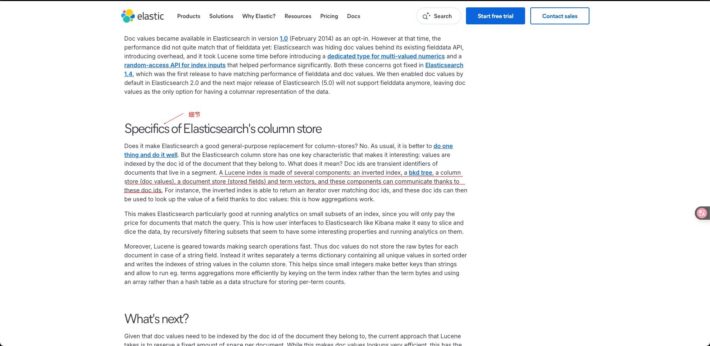

# Lucene 索引磁盘占用分析(列存储细节)
A Lucene index is made of several components: an inverted index, a bkd tree, a column store (doc values), a document store (stored fields) and term vectors, and these components can communicate thanks to these doc ids. (Lucene 索引由几个组件组成：倒排索引、bkd 树 、列存储（文档值）、文档存储（存储字段）和术语向量，这些组件可以通过这些文档 ID 进行通信。)
+ inverted index: 倒排索引，不用多说。
+ bkd tree: Block k-d tree，用于在高维空间内做索引，如地理坐标的索引。
+ column store: 列式存储，可以充分利用操作系统的缓存，批量读取连续的数据以提高排序和聚合的效率。
+ document store: 用于存储文档，功能和_source字段有重合，下文详细介绍区别。
+ term vectors: 用于存储各个词在文档中出现的位置等信息。

---

## 参考资料
+ [Elasticsearch as a column store](./-998.REFS/Elasticsearch%20as%20a%20column%20store%20_%20Elastic%20Blog.pdf)
+ [Elasticsearch as a column store-译](./-998.REFS/Elasticsearch%20作为列存储%20_Elastic%20博客%20---%20Elasticsearch%20as%20a%20column%20store%20_%20Elastic%20Blog.pdf)